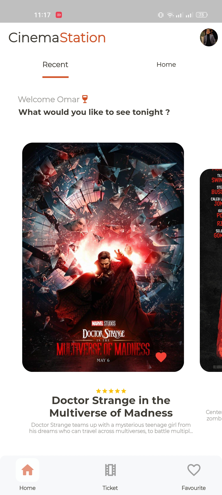
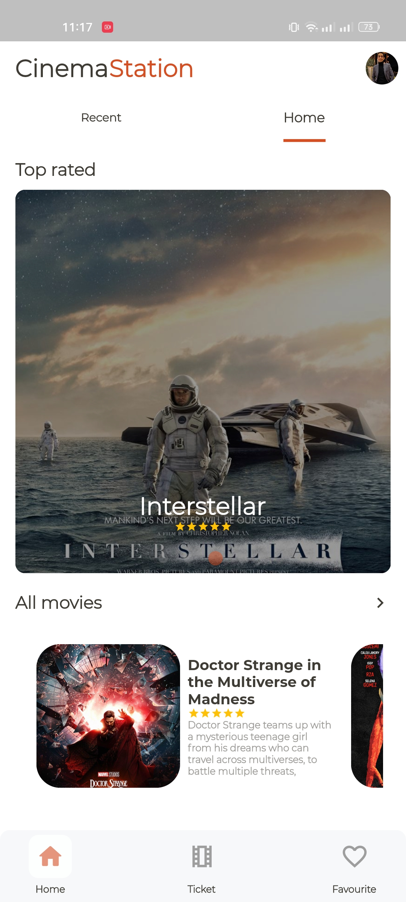

# cinema Station - cinema resevation.

Flutter based mobile application for cinema seats reservation with an fully functioning
Admin application to manage the application – with cinema station you will be able to fnd, explore
and book your seats from home. 

#Used technologies:

- BLOC "CUBIT" for state management.
- HTTP package.
- Firebase "realtime database - firebase authentication - firestore".
- Shared preferences.
- Hydrated bloc.
- Intl "for parsing time and date".
- pathfinder
- image picker
- barcode generator

#Features:
- full authentication system
- good UI for user experience 
- profile management 
- dart mode
- ticket review 
- add movies to favourite
- admin system for adding movies

  
  

